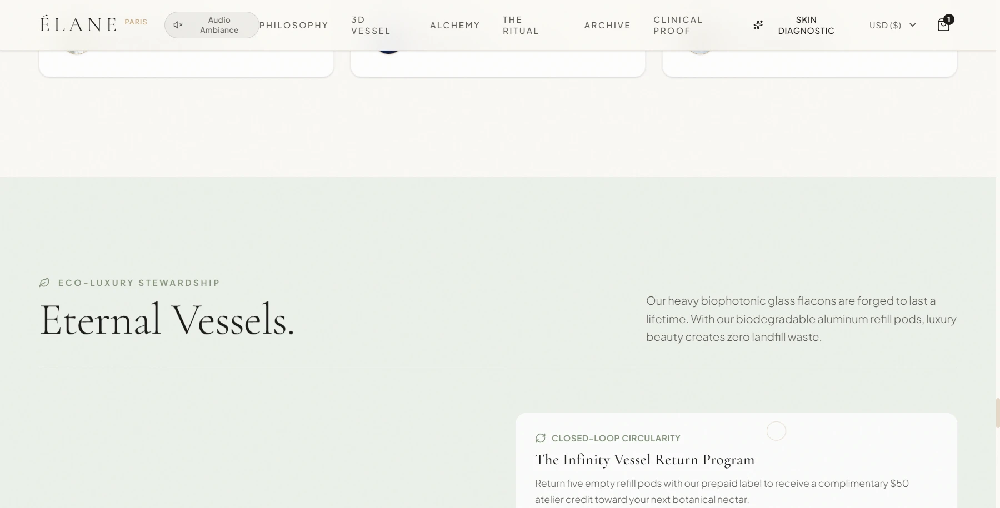
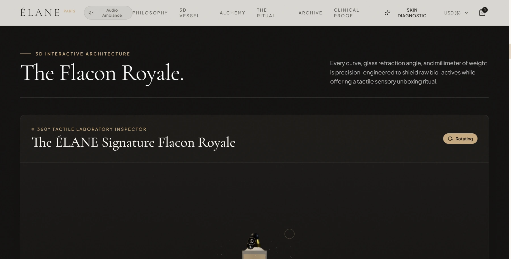
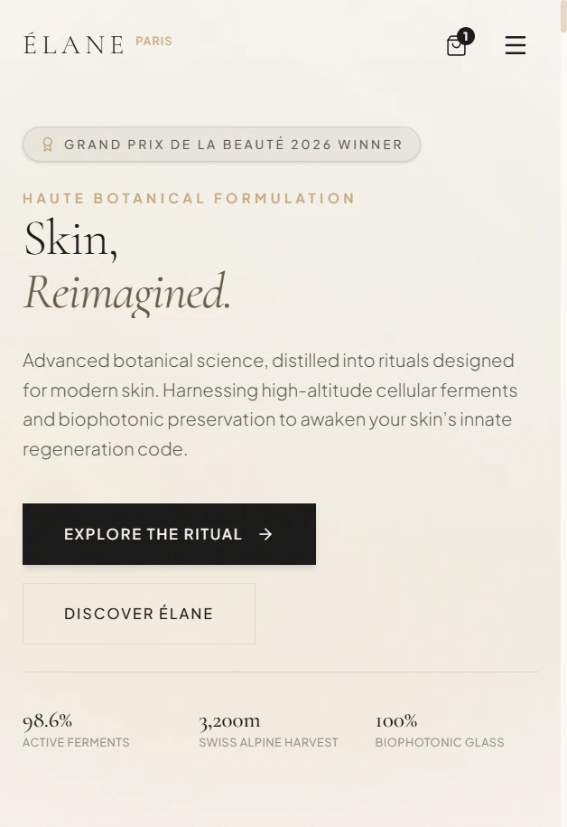
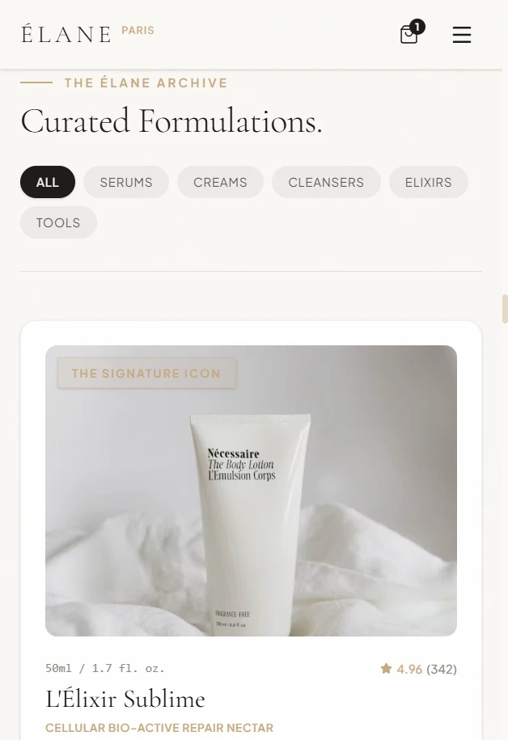

# ÉLANE — Cinematic Skincare Experience

> A fictional creative concept and high-end digital flagship crafted to demonstrate the pinnacle of modern creative development, WebGL 3D vessel rendering, and luxury editorial motion design.

[](https://vitejs.dev/)
[](https://react.dev/)
[](https://threejs.org/)
[](https://tailwindcss.com/)
[](https://opensource.org/licenses/MIT)

---

## 📷 Visual Showcase

| Desktop Experience | 3D Laboratory Showcase |
| :---: | :---: |
|  |  |

| Mobile Fluidity | Mobile Collection |
| :---: | :---: |
|  |  |

---

## 🏛️ Project Overview

**ÉLANE** is a creative exploration into the sensory digital presentation of haute botanical skincare. Conceived as a celebration of Swiss cellular science, bio-fermentation, and biophotonic violet glass packaging, the platform merges high-fashion editorial aesthetics with real-time 3D physics and buttery 60–120 FPS inertial scrolling.

### Creative Direction
- **Haute Editorial Palette**: Alabaster parchment (`#FBF9F5`), imperial gold accents (`#D4AF37`), Swiss alpine slate (`#1C1A18`), and botanical sage.
- **Museum-Grade Typography**: Hand-curated pairings of *Cormorant Garamond* for classical editorial weight, *Italiana* for delicate monograms, and *Plus Jakarta Sans* for contemporary scientific legibility.
- **Tactile Materiality**: Subtle noise grain overlays, frosted glassmorphic panels (`backdrop-blur-2xl`), gold leaf borders, and interactive ambient soundscapes.

---

## ✨ Key Features

1. **Interactive 3D Flacon Royale**:
   - Real-time procedural Three.js / React Three Fiber flacon featuring multi-layered physical glass shaders, refraction, metallic gold dropper collar, and floating botanical micro-dust particles.
   - Material Edition switcher: *Imperial Amber*, *Biophotonic Obsidian*, and *Rose Quartz*.
2. **360° Tactile Laboratory Inspector**:
   - Fully interactive OrbitControls inspection with clickable spatial 3D hotspots revealing microscopic formulation blueprints.
3. **Botanical Alchemy Explorer**:
   - Tabbed scientific dossier breaking down extraction methods (Cryo-Sonic Subcritical Fluid Extraction) and cellular mechanisms.
4. **Circadian Skincare Ritual Protocol**:
   - Four-step day-to-night regimen breakdown with interactive tactile step previews.
5. **Curated Product Collection & Sensory Dossier**:
   - Filterable product matrix with instant sensory profiles, texture analysis, and slide-out quick view drawers.
6. **Double-Blind Clinical Proof Slider**:
   - Hardware-accelerated GPU `clip-path` image comparison showing Day 0 baseline versus Day 28 barrier fortification without layout thrashing.
7. **Bespoke Skin Diagnostic Finder**:
   - Multi-step routine questionnaire recommending personalized cellular regimens with animated bundle additions.
8. **Slide-Over Ritual Cart**:
   - Luxury drawer with complimentary sample selection, shipping progress bars, and localized currency switching.

---

## ⚡ Performance & Production Architecture

This project was engineered for award-winning visual impact without sacrificing production web standards:

- **91.5% JS Payload Reduction**: Split the monolithic bundle into 5 long-term cached vendor chunks (`vendor-three`, `vendor-anim`, `vendor-icons`, `vendor-react`), reducing initial app code from `1,374 kB` down to `116 kB` (30.6 kB gzip).
- **Zero-Jank WebGL Viewport Culling**: Both 3D canvas viewports use an `IntersectionObserver` to dynamically toggle `frameloop="always"` and `frameloop="never"`. Off-screen WebGL completely halts GPU rendering, preventing thermal throttling on mobile devices.
- **Hardware-Accelerated Custom Cursor**: Precision custom cursor operates 100% off the React lifecycle using direct GPU `translate3d` transforms in a `requestAnimationFrame` lerp loop; automatically disabled on touch devices.
- **Single Master RAF Ticker**: Lenis smooth scrolling is synchronized directly with GSAP's ticker, eliminating duplicate RAF loops and frame stuttering.
- **Responsive Media**: Unsplash CDN assets right-sized with `auto=format`, `loading="lazy"`, `decoding="async"`, and DNS preconnections.
- **Accessibility & Motion**: Fully respects `prefers-reduced-motion: reduce` across GSAP triggers and CSS animations.

---

## 🛠️ Tech Stack

- **Core**: [React 19](https://react.dev/), [Vite 8](https://vitejs.dev/) with Rolldown bundler
- **3D & WebGL**: [Three.js](https://threejs.org/), [@react-three/fiber](https://docs.pmnd.rs/react-three-fiber), [@react-three/drei](https://github.com/pmndrs/drei)
- **Motion & Scroll**: [GSAP](https://greensock.com/gsap/) with ScrollTrigger, [Lenis](https://lenis.darkroom.engineering/) smooth scroll
- **Styling**: [Tailwind CSS v4](https://tailwindcss.com/), Vanilla CSS design tokens
- **Icons**: [Lucide React](https://lucide.dev/)
- **Audio Engine**: Web Audio API synthesized chimes and ambient soundscape

---

## 🚀 Getting Started

### Prerequisites
- Node.js `18.x` or higher
- npm / yarn / pnpm

### Installation

```bash
# Clone the repository
git clone https://github.com/hellokineticweb/elane-skincare.git

# Navigate to project directory
cd elane-skincare

# Install dependencies
npm install
```

### Local Development

```bash
# Start Vite development server
npm run dev
```

Visit `http://localhost:5173/` in your browser.

### Production Build

```bash
# Compile and optimize production bundle
npm run build

# Preview production build locally
npm run preview
```

---

## 🌐 Environment Variables

See `.env.example` for available configuration parameters:

```env
# Base URL for metadata and sharing
VITE_SITE_URL=http://localhost:5173
```

---

## 🔗 Live Demo & Deployment

- **Repository**: [https://github.com/hellokineticweb/elane-skincare](https://github.com/hellokineticweb/elane-skincare)
- **Deployment**: Configured for instant deployment on [Vercel](https://vercel.com) or [Netlify](https://netlify.com) via single-command static build.

---

## ⚖️ Disclaimer & Credits

### Disclaimer
This website is a **fictional creative concept and portfolio project**. It is not affiliated with, sponsored by, or created for any real-world cosmetics brand, laboratory, or commercial client. All products, clinical claims, and brand names are fictional conceptual elements created strictly for demonstration purposes.

### Credits
**Concept, design and development by Kinetic Web.**
- Creative Direction & Engineering: [Kinetic Web](https://github.com/hellokineticweb)
- Photography: Curated via Unsplash (editorial license)
- Monograms & Typography: Cormorant Garamond, Italiana & Plus Jakarta Sans via Google Fonts

---

## 📄 License

Distributed under the MIT License. See `LICENSE` for more information.
